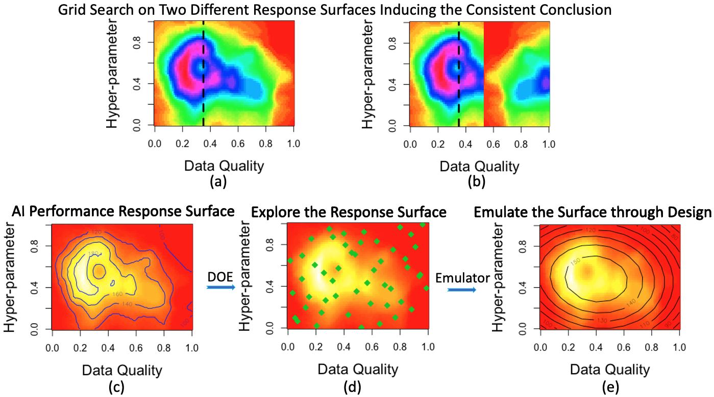



# Introduction

In machine learning, supervised learning is a major component. To train a supervised learning method, one often needs:

1. A training data with inputs and responses.
2. A model estimation procedure, often optimizing with respect to model parameters such that the estimated model fits the data well.
   
Most of the focus of the machine learning community is about (2), creating better algorithms for learning from data.
But getting useful annotated datasets is difficult. Really difficult. It can be expensive, time consuming, and you still end up with problems like annotations missing from some categories.

I think that being able to build practical machine learning systems is a lot about tools to annotate data, and that a lot of the future innovation in building systems that solve real problems will be about being able to annotate high quality datasets quickly.

Active Learning is a great building block for this, and is under utilized in my opinion.

In this post I will give a short introduction to classical Active Learning, and then go over several papers that focus on Active Learning for Deep Learning.

# Motivation

In many scenarios we will actually have access to a lot of data, but it will be infeasible to annotate everything.
Just a few examples:

- A billion images scraped from the internet.
- A video recorded from a dash cam that is a month long.
- A scanned biopsy that has a million cells inside it.

There are two closely related fields that help us deal with these scenarios:

* *Semi-supervised Learning*.
Exploit the unannotated data to get better feature representations and improve the algorithms learned on the annotated data.

* *Active Learning*.
 Choose the data that is going to be annotated.
 
 
# Active Learning: Higher accuracy with less data annotation

{height="300" width="500"}

*Image from https://arxiv.org/abs/1703.02910*

The image above is a typical image in a paper about active learning. 
The x axis is the size of the dataset. The y axis is accuracy on the test set.

A good active learning algorithm is able to cleverly select that data we are going to annotate, so that when we train on it, our model will be better than if we trained on other data.

So if for example we have the constraint of being able to annotate only 400 images, the goal of active learning will be to select the best 400 images to annotate.

## Query by committee QBC

Another concept from classical active learning papers, is QBC. 
The idea here is that instead of measuring the uncertainty of a single model, we can train an ensemble of many different models (maybe with different seeds, or hyper-parameters, or structures).
Then for a given image, we can check if the output changes a lot between models. If it does, it means the models aren't very consistent about this image, and some of them aren't doing a good job on this image.

In the typical QBC implementation, every model decides the output category and votes for it, and a vector with the vote count is created.

- Some examples of how his vote vector can be used as an uncertainty measure.
	- (Minimize) The difference between the two categories with the most votes.
	
	- (Maximize) Vote Entropy: $$ -\frac{V(c)}{C}Log(\frac{V(c)}{C}) $$

# Summary
In the era of Data Sceince, I think active learning methods have great potential.
